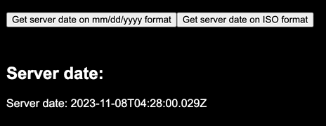

# Create a dynamic component

For a component to have dynamic behavior -that is, to being able to update or re-render its contents without reloading the whole page- it needs to be explicitely configured as a **dynamic component**.

Currently, creating a dynamic component can be achived in two ways: Using the `GetDynamicComponent` helper function, or extending the `DynamicComponent` abstract class:

## GetDynamicComponent

```jsx
export const MyDynamicComponent = GetDynamicComponent<MyData,SXLGlobalContext>(
    "my-dynamic-component",
    async () => {
        const data = await getData()
        return data;
    },
    (data, props) => {
        if (data.isPending) {
            return <>Loading...</>;
        }

        return <div>Loaded: {data.value}</div>
    },
);

// ...

<MyDynamicComponent.Render />
```

The `GetDynamicComponent` function receives three arguments:

- Component ID (`string`): A unique ID used to identify the dynamic component.
- Data Fetcher (`() => MyData`): A function that returns a `Promise` with the data the component needs to fetch. The type for the Promise contents is passed in the `GetDynamicComponent` first type parameter (e.g. `MyData`).
- Render function: (`(data:TrackedPromise<MyData>, props: SXL.Props) => JSX.Element`): A function that receives the promise returned by the data fetcher, wrapped in `TrackedPromise` -which is an extension for `Promise` that exposes methods for tracking its state-, and the props passed to the component.

## Extending DynamicComponent

A more traditional-component approach to create dynamic components is to extend the `DynamicComponent` abstract class:


```tsx
@Register
export class JSComponent extends DynamicComponent<string> {
    componentID = "dynamic-slow";

    async fetcher() {
        await wait(100);
        return "Slow resource";
    }

    dynamicRender(
        resource: TrackedPromise<string>,
    ): SXL.StaticElement | SXL.AsyncElement {
        if (resource.isPending) {
            return <p id="loading2">Loading...</p>;
        }
        return <p id="loaded2">{resource.value}</p>;
    }
}

//...
<JSComponent/>
```

Just like the `GetDynamicComponent`, extending `DynamicComponent` requires you to override three parts:

- `componentID`: (`string`) The unique string ID used to identify this component. Notice that this can be different from the actual component name that will be used in the JSX markup (`JSComponent` vs `dynamic-slow`).
- `fetcher`: (`(props: Props) => Promise<T>`) The function that will be used to retrieve the asynchronous data a component will need to be rendered.
- `dynamicRender`: (`(data: TrackedPromise<T>, props: Props) => SXL.StaticElement | SXL.AsyncElement`) The function that will render the components content, based on the state of the fetched data (`TrackedPromise` is a thin wrapper around `Promise` which expose its fullfilment state).

Also, notice the use of the `@Register` decorator on the component definition. This is needed to auto-register the component in LeanJSX's engine -creating an API endpoint for it-.

Optionally, the component class can override the `queryParams` method, which receives a reference to the server's `Request` object, and returns an object. These query params are set using the **webAction** helper.

## Updating a dynamic component

All dynamic components can be updated using the [webAction](/docs/architecture/state-and-context#the-webaction-helper) helper:

```jsx
<button
    onclick={webAction({}, (ev, webContext) => {
        webContext?
          .actions?
          .refetchElement("my-dynamic-component", {
            // pass query parameters
          });
    })}>
    Reload
</button>
```

This helper creates all bindings necessary to update a dynamic component.

The `refetchElement` receives two parameters:

- Component ID (`string`): The ID for the component to update
- Query parameters (`Record<string, string>`): A map of query parameters for the updated component.

## Example: Rendering the server's date

Let us create an example to understand how to update dynamic components.

First, we will create a dynamic component called `ServerDateComponent`:

```tsx
type ServerDateComponentContext = SXLGlobalContext & { mmDDYY?: boolean };

@Register
export class ServerDateComponent extends DynamicComponent<
    Date,
    ServerDateComponentContext
> {
    componentID = "my-server-date-component";

    async fetcher() {
        const serverDate = await getServerDate();
        return serverDate;
    }

    queryParams(req: Request) {
        return {
            mmDDYY: Boolean(req.query?.mmDDYY),
        };
    }

    dynamicRender(
        data: TrackedPromise<Date>,
        props: SXL.Props<ServerDateComponentContext>,
    ): SXL.StaticElement | SXL.AsyncElement {
        if (data.isPending) {
            return <>Loading...</>;
        }

        const serverDate: Date = data.value;

        if (props?.globalContext?.mmDDYY) {
            const dateFormatted = new Intl.DateTimeFormat("en-US", {
                year: "numeric",
                month: "2-digit",
                day: "2-digit",
            }).format(serverDate);
            return <div>Server date: {dateFormatted}</div>;
        }
        return <div>Server date: {serverDate.toISOString()}</div>;
    }
}
```

The `ServerDateComponent` does a couple of things:

- Two type parameters are passed to the `DynamicComponent` signature:
  - `Date`: The type for the data returned by the fetcher.
  - `ServerDateComponentContext`: An extension of the global context `SXLGlobalContext` with the boolean query parameter `mmDDYY`.
- We pass a fetcher function that retrieves a date from the server using `getServerDate()`.
- While the component is fetching the server date, a `Loading` message will be displayed.
- Once the promise is resolved, the server `Date` object is retrieved using `data.value`.
- Then, depending whether `mmDDYY` is `true` or `false`, it renders a string representation either in format `mm/dd/yy` or ISO.

> _**Note**: All this logic happens on the server side. The dynamic component on the browser-side will receive the fully rendered HTML content returned by the component. Any temporary state contained by the component on the browser (e.g. the text in any input field) will be discarded if it's not explicitely sent to the server as a query parameter._

Now, let's create a second **static** component which will update the contents of our dynamic `ServerDateComponent`:

```jsx
export function ReplacerComponent() {
    return (
        <>
            <button
                onclick={webAction({}, (ev, webContext) => {
                    webContext?.actions?.refetchElement(
                        "my-server-date-component",
                        {
                            mmDDYY: true,
                        },
                    );
                })}
            >
                Get server date on mm/dd/yyyy format
            </button>
            <button
                onclick={webAction({}, (ev, webContext) => {
                    console.log("Replace");
                    webContext?.actions?.refetchElement(
                        "my-server-date-component",
                        {},
                    );
                })}
            >
                Get server date on ISO format
            </button>
        </>
    );
}
// ...
<ReplacerComponent/>
```

Notice a few things here:

- Static components *can* use the `webAction` helper. A component doesn't need to be a dynamic component to update another dynamic component.
- The component renders two buttons, both of which updates the dynamic component using its ID (`"my-server-date-component"`):
  - The first button passes the `mmDDYY` query parameter set to `true`.
  - The second button passes no query parameters, which will re-render the dynamic component using its default state (rendering the date in ISO format).

After rendering both components, we can see the dynamic component being updated correctly:



In short, dynamic components allow us to explicitely choose what parts of our application will need to be rendered using JavaScript and updated without refreshing the whole page. With LeanJSX components, the following concerns are taken care for **free**:

- Writing the JavaScript code to request data and update the page content.
- Writing the API endpoint code for dealing with the data request.
- Writing the JavaScript code to wire everything together.